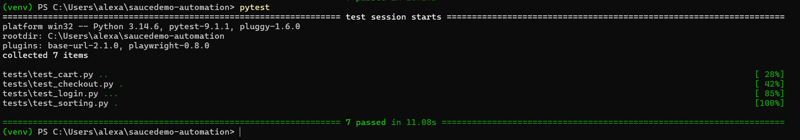

# SauceDemo Automation

An automated UI test suite for [saucedemo.com](https://www.saucedemo.com), built with
**Playwright** and **Python (pytest)**. The project converts manual test cases into
repeatable automated checks covering the core e-commerce flows of the application.



## Coverage

The suite exercises the main user journeys through the SauceDemo storefront:

- **Login** — valid and invalid authentication scenarios (`tests/test_login.py`)
- **Cart** — adding and removing products from the shopping cart (`tests/test_cart.py`)
- **Checkout** — completing the end-to-end checkout flow (`tests/test_checkout.py`)
- **Product sorting** — verifying the product list sort options (`tests/test_sorting.py`)

## Tech stack

- [Python](https://www.python.org/)
- [pytest](https://docs.pytest.org/) as the test runner
- [Playwright for Python](https://playwright.dev/python/) for browser automation

## Setup

1. Create and activate a virtual environment:

   ```powershell
   python -m venv venv
   venv\Scripts\Activate.ps1
   ```

   On macOS/Linux:

   ```bash
   python -m venv venv
   source venv/bin/activate
   ```

2. Install the dependencies:

   ```bash
   pip install -r requirements.txt
   ```

3. Install the Playwright browsers:

   ```bash
   playwright install
   ```

## Running the tests

Run the full suite:

```bash
pytest
```

Run a single test file, e.g. the login tests:

```bash
pytest tests/test_login.py
```

Run with more detailed output:

```bash
pytest -v
```
